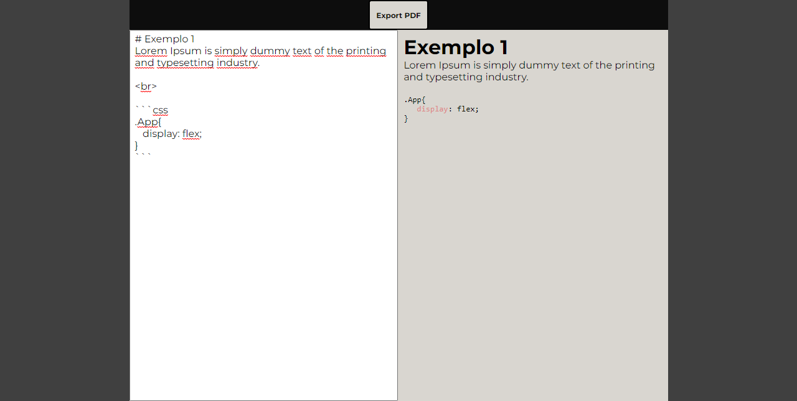

# Markdown Editor

This project aims to apply knowledge in React, Typescript, Styled-components and Storybook, creating a functional markdown editor, capable of exporting the result as a pdf.

## Exemple

[PDF exported](./assets/export.pdf)

## Technologies

  
  
  
  

## Shame File

The 'shamefile.txt' file contains explanations of practices used that are not recommended.
